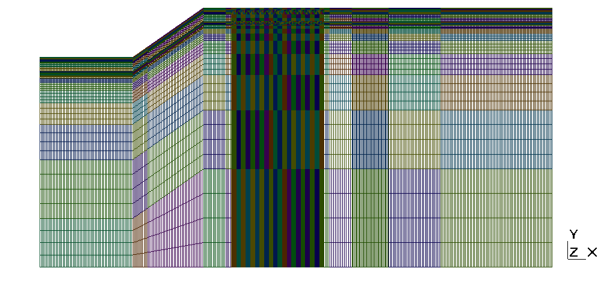
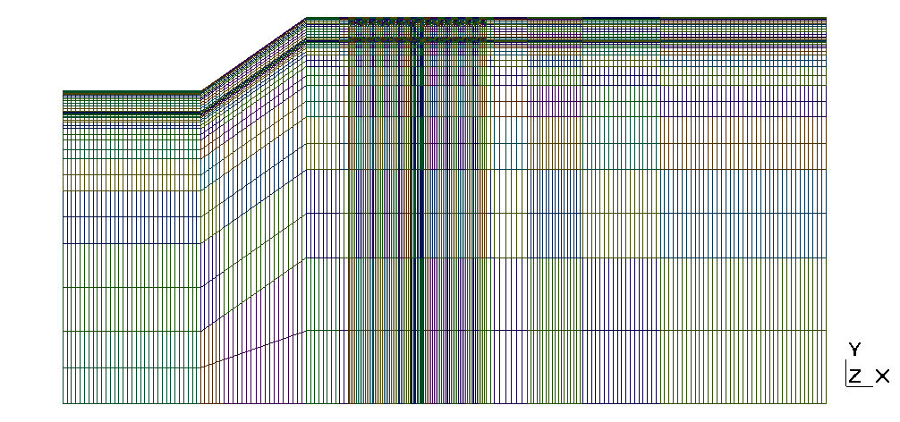

## Requirements
 - deall.ii 8.5.0 - https://www.dealii.org/
 - PETSc 3.6.0
 - some custom libraries - https://github.com/zerpiko/libraries
 - GNU compiler 4.8.5
 - Intel MPI 2016 (20160601)
 - GMSH 2.7.0 (to visualize mesh files)

Other compilers and libraries might work but I haven't tested them.

## Instructions
The program expects only one argument, the name of the file with the input parameters.
To execute:

```shell
./mycode input.prm
```

## Mesh files
Two options at the moment:

 - trl_2d_refined_2.msh : 39405 vertices, 41576 elements
 - trl_2d_refined.msh : 10335 vertices, 10980 elements

 
 
