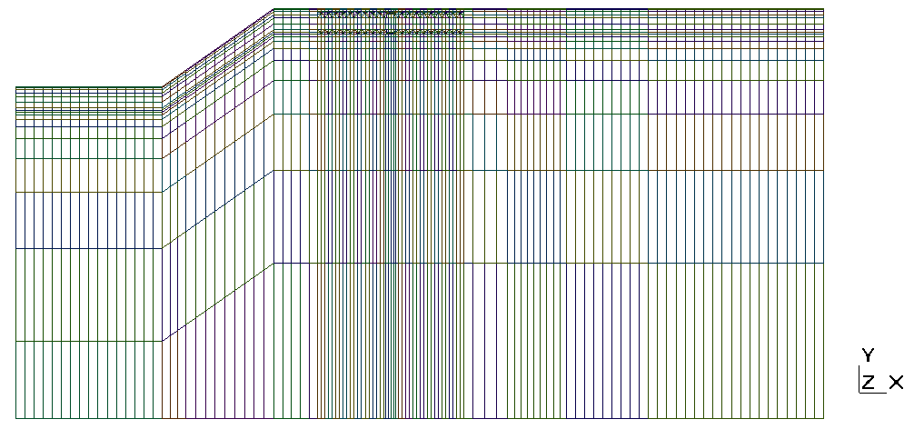
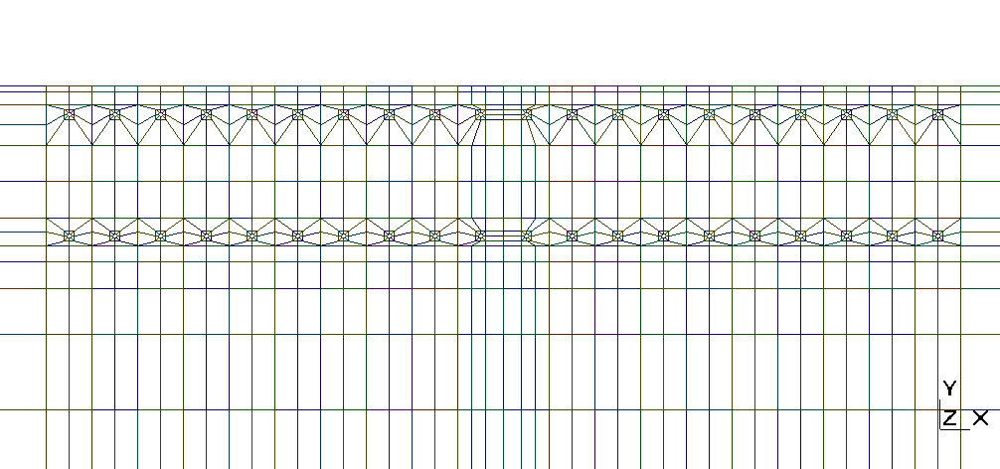

## Requirements
 - deall.ii 8.5.0 - https://www.dealii.org/
 - PETSc 3.6.0
 - some custom libraries - https://github.com/zerpiko/libraries
 - GNU compiler 4.8.5
 - Intel MPI 2016 (20160601)
 - GMSH 2.7.0 (to visualize mesh files)

Other compilers and libraries might work but I haven't tested them.

## Instructions
The program expects only one argument, the name of the file with the input parameters.
To execute:

```shell
./mycode input.prm
```

The program requires an `output` directory in the same location where the program is
executed.

## Mesh files
Current mesh::

 - trl_refined_in_2d.msh : 2706 vertices, 3038 elements

This mesh can be further refined within the program if needed.

| whole domain | zoom to pipes section |
|----------------------|--------------------|
|  |  |
